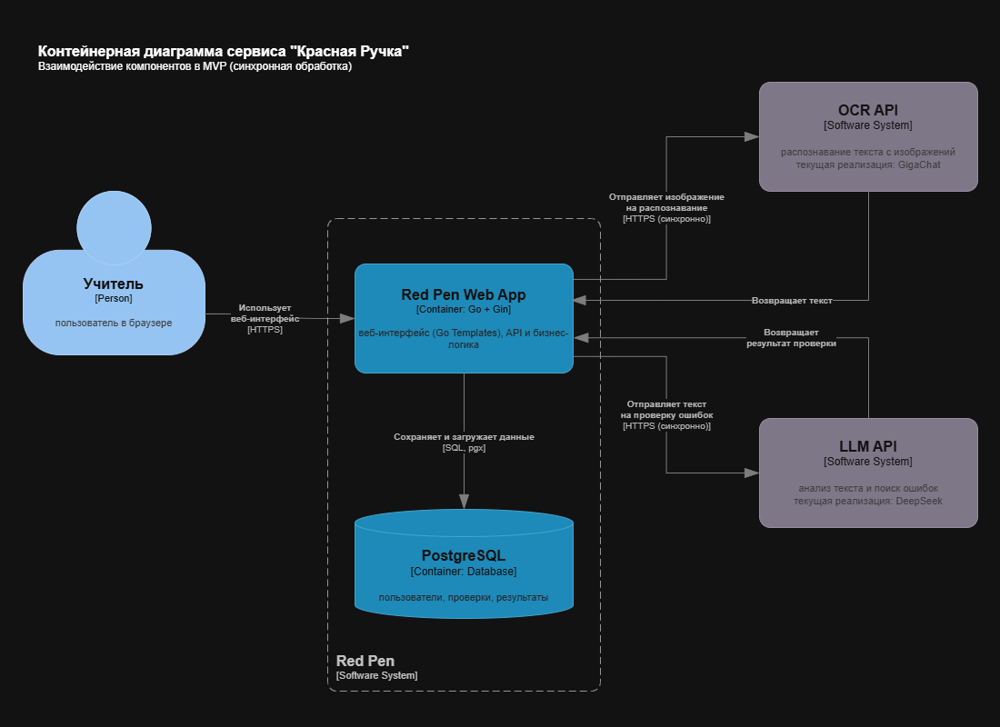

# Архитектура сервиса «Красная Ручка» (redpen-checker)

## Обзор

Система состоит из следующих основных компонентов:

* **Веб-приложение на Go (Gin)** — пользовательский интерфейс, API и бизнес-логика.
* **PostgreSQL** — хранение пользователей, проверок и результатов.
* **OCR-модуль** — распознавание текста с изображений. Текущая реализация использует Yandex Vision API (модель `handwritten`).
* **LLM-модуль проверки** — анализ текста и поиск ошибок. Текущая реализация использует DeepSeek API.

Веб-приложение взаимодействует с внешними AI API по HTTP(S), а с PostgreSQL — через драйвер pgx. В MVP проверка одной работы выполняется синхронно.

## Контейнерная диаграмма (C2)

Источник диаграммы: `docs/analysis/container-diagram.drawio.xml`



## Технологический стек

* Язык: Go 1.26 (актуальная стабильная версия)
* Веб-фреймворк: Gin
* База данных: PostgreSQL
* Драйвер БД: pgx
* Миграции: golang-migrate
* Контейнеризация: Docker, Docker Compose
* CI/CD: GitHub Actions

## Ключевые архитектурные решения

### 1. Бессерверная AI-обработка

OCR и анализ текста выполняются через внешние AI API.

Преимущества:

* отсутствие необходимости поддерживать собственную GPU-инфраструктуру;
* снижение стоимости эксплуатации;
* возможность замены AI-провайдера без серьёзных изменений бизнес-логики.

### 2. Простая синхронная обработка в MVP

MVP ориентирован на минимальную сложность реализации и сопровождения.
В MVP пользователь загружает одну работу и ожидает результат проверки.

Подготовлена возможность перехода к фоновой обработке задач в будущих версиях.


### 3. Адаптивный интерфейс (mobile-first)

Интерфейс проектируется по принципу mobile-first и должен одинаково корректно работать на смартфонах, планшетах и ноутбуках.

В MVP используется серверный рендеринг HTML на Go Templates.

Для улучшения пользовательского опыта могут использоваться лёгкие JavaScript-библиотеки (например, HTMX).

Использование SPA не планируется для MVP.

### 4. Работа при нестабильном соединении

Система должна сохранять введённые данные формы и позволять повторить отправку после восстановления соединения.

Полноценная офлайн-синхронизация не входит в MVP и рассматривается как развитие продукта.

### Почему Yandex Vision, а не GigaChat

В ходе тестирования GigaChat API показал склонность к исправлению орфографических ошибок и галлюцинациям при работе с детским почерком. Yandex Vision, напротив, возвращает текст дословно, сохраняя все ошибки, что критически важно для их последующего анализа. Кроме того, Yandex Vision оптимизирован для русского рукописного текста и не требует внешней GPU-инфраструктуры.

## Внутренняя архитектура

Для MVP используется упрощённая модульная структура. 

```text
internal/
├── config     # конфигурация приложения
├── handler    # HTTP-обработчики
├── service    # бизнес-логика
└── storage    # работа с БД
```

По мере развития проекта модули могут быть выделены в отдельные пакеты (auth, check, ocr, llm и др.).

## Безопасность

* Регистрация и аутентификация по email и паролю.
* OAuth-провайдеры рассматриваются как возможное развитие продукта.
* Все секреты хранятся в переменных окружения и секретах CI/CD.
* Передача данных выполняется только по HTTPS.
* Доступ к данным пользователей ограничивается их учётной записью.